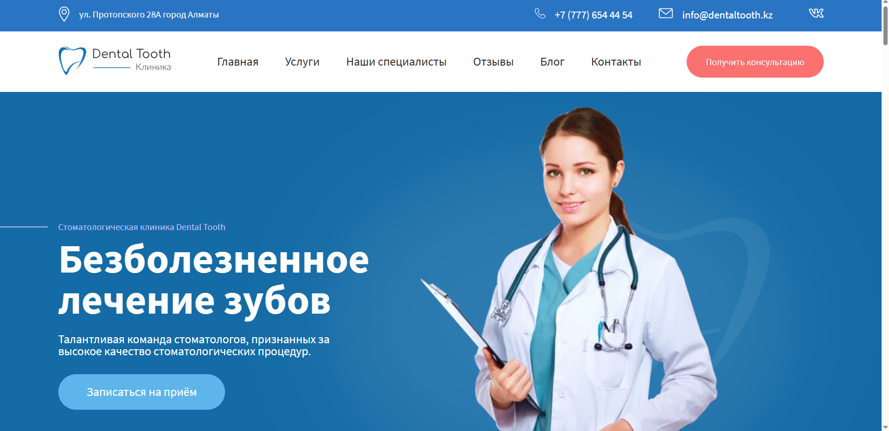
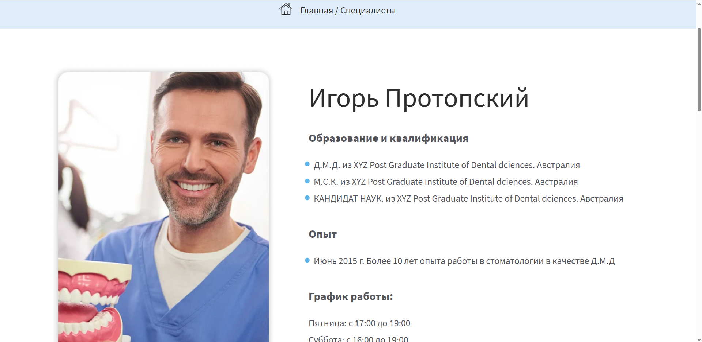

# 🦷 Dental Tooth - Сайт стоматологической клиники

Современный многостраничный статический сайт для стоматологической клиники. 
Проект демонстрирует навыки семантической верстки, создания адаптивных пользовательских интерфейсов и работы с анимациями на чистом CSS и JavaScript.

🔗 **Демо:** https://superpnz.github.io/Dental_Tooth/
📦 **Репозиторий:** https://github.com/Superpnz/Dental_Tooth
<br />
🎨 **Figma макет:** https://www.figma.com/design/WjnwBRD9PtYZcNIcOs89YF/Dental-Tooth?node-id=0-1&p=f&t=9QPGJh984pIGhRrF-0 

---
## 📸 Скриншоты

### Главный экран


### Страница с информацией о врачах


### Кастомная страница ошибки 404


---
## 🎯 О проекте

Это учебно-практический проект, созданный для отработки навыков создания полноценных многостраничных сайтов без использования тяжелых фреймворков.

Основной фокус:
* Семантическая и доступная HTML-разметка
* Адаптивная верстка (Mobile-first подход)
* Чистый, структурированный CSS с использованием методологии, близкой к БЭМ

---

## ✨ Функциональность

### 📄 Многостраничная структура
- **Главная страница:** презентация клиники, ключевые преимущества и список услуг
- **Страница врачей:** карточки специалистов с описанием их компетенций
- **Блог:** страница со списком статей и страница отдельной публикации
- **Контакты:** страница с информацией для связи и записи на прием

### 🎨 Пользовательский опыт
- Полностью адаптивный дизайн для мобильных устройств, планшетов и десктопов
- Плавные CSS-переходы и hover-эффекты для интерактивных элементов
- Реализация адаптивных слайдеров (каруселей) с помощью библиотеки **Swiper 14.0.5**
- Интеграция легковесных модальных окон через **jQuery Magnific Popup**
- Кастомная, стилизованная страница ошибки 404
- Оптимизированная навигация между разделами сайта

---

## 🛠️ Стек технологий

* **HTML5** (семантическая разметка)
* **CSS3** (адаптивность, анимации, переменные)
* **JavaScript (Vanilla)** (минимальная интерактивность)
* **Swiper 14.0.5** (для реализации плавных и адаптивных слайдеров)
* **jQuery Magnific Popup** (для легковесных модальных окон)
* **Git & GitHub Pages** (хостинг и контроль версий)

---

## 📁 Архитектура проекта

```bash
Dental_Tooth/
 ├── css/            # стили проекта
 ├── js/             # скрипты для интерактивности
 ├── images/         # изображения и иконки
 ├── fonts/          # локальные веб-шрифты
 ├── index.html      # главная страница
 ├── dentists-page.html  # страница врачей
 ├── blog.html       # страница блога
 ├── blog-single.html    # страница одной статьи
 ├── contacts-page.html  # страница контактов
 └── 404.html        # кастомная страница ошибки
```

---

## ⚙️ Установка и запуск

Поскольку это статический сайт, для его запуска не требуется сложная настройка окружения, Node.js или сборщики.

### 📥 Клонирование репозитория

```bash
git clone https://github.com/Superpnz/Dental_Tooth.git
cd Dental_Tooth
```

## 🚀 Способы запуска

### 💻 Способ 1: Локальный запуск через VS Code (рекомендуется)

1. Открой папку проекта в **Visual Studio Code**
2. Установи расширение **Live Server** (если ещё не установлено)
3. Открой файл `index.html` и нажми кнопку **«Go Live»** в правом нижнем углу окна VS Code

Сайт автоматически откроется в браузере по адресу `http://127.0.0.1:5500/`

### 🌐 Способ 2: Прямой запуск в браузере

Просто открой файл `index.html` двойным кликом в любом современном браузере.

> **Обрати внимание:** при прямом запуске некоторые функции (например, загрузка локальных шрифтов или работа с картами) могут работать некорректно из-за ограничений протокола `file://`. Рекомендуется использовать первый способ.
---


## 👨‍💻 Автор

**Superpnz / Maxim Anikeev**
GitHub: https://github.com/Superpnz
